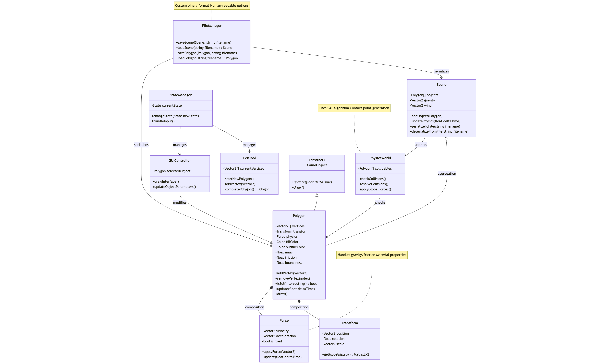

# PolySim
2D polygon drawing utility with realistic rigid-body physics calculations. Have fun flooding your scene with wacky collisions or run simulations to determine feasibility before real world implementations.

---

## Features 📃

### Drawing ✒️
- Interactive drawing through a click-and-drag interface for manipulating vertices
- Real-time preview as you draw
- Recognizes self-intersecting polygons
- Handle multiple objects and their creation simultaneously

### Physics ⌛
- Realistic collision and inertia between objects, interaction is determined by shape
- Adjust gravity strength, direction in real time
- Add global forces such as wind throughout the scene

### Customization 🎨
- Parameterized objects, adjust mass, friction and bounciness per subject
- Fix objects in 2D space to influence the simulation
- Visual/Appearance tweaking, apply fun colors and outlines to differentiate between each piece
- Modify polygons after their creation, add vertices or remove

### Scene Storage 💾
- Scene is stored using custom binary files, in a human readable/modifiable format
- Complete physical state of the simulation is stored alongside objects and their positions
- Load/Unload not only full scenes but individual objects

---

## Tech Stack ⚡
- Raylib + RayGUI for handling all things graphics
- Custom MyStr and MyVector libraries for string/container operations

---

## Technical Implementation ⚙️

### Core Architecture

**Logical Objects**:
- **Polygon**: Stores vertex/edge data with visual settings (composition with Transform and Force components)
- **Transform**: Handles position, rotation and scale
- **Force**: Manages mass and force vectors for physics
- **Scene**: Contains polygons with their transforms and global properties

**Program Components**:
- **PenTool**: Vertex placement and object creation
- **StateManager**: Template-based state pattern for different modes
- **FileManager**: Scene/object serialization with exception handling
- **PhysicsWorld**: Coordinates all physics interactions
- **GUI Controller**: Interface for parameter adjustment

### Object Relationships
- **Composition**: Transform/Force are integral to Polygon objects
- **Aggregation**: Scene contains but doesn't own Polygons
- **Association**: GUI references objects for modification

### Inheritance & Polymorphism
- **GameObject** base class with virtual methods (update/render)
- Polymorphic containers handle different object types uniformly

### Physics Implementation
**Collision System**:
- SAT algorithm for precise detection
- Contact point generation for realistic responses

**Force Integration**:
- Numerical methods for translation calculations
- Handles gravity, friction, and user interactions
- Material properties affect bounce/sliding behavior

### File System
**Binary Format Features**:
- Complete geometric and physics state preservation
- Modular saving of individual objects or full scenes

### Templates
- Generic collision detection algorithms
- Vector class for type-safe dynamic arrays

### Exception Handling
- File I/O operations with try-catch blocks
- Physics calculation safeguards
- User input validation

### Logging System
- Event tracking for user actions/physics
- Runtime monitoring display

---

## Educational Objectives 📚

- Class design and inheritance hierarchies
- Physics/mathematics integration
- Structured file I/O systems
- Intuitive UI for complex parameters
- Efficient resource handling

---

## Usage 🖲️

1. **Draw**: Click to place vertices, complete shapes with right-click/escape
2. **Simulate**: Toggle physics for realistic collisions
3. **Customize**: Adjust mass, friction, bounciness and appearance
4. **Save/Load**: Preserve complete scene states
5. **Experiment**: Modify gravity and global forces

---
## Logic Flow 🚿

---
## UML Class Diagram 📈
